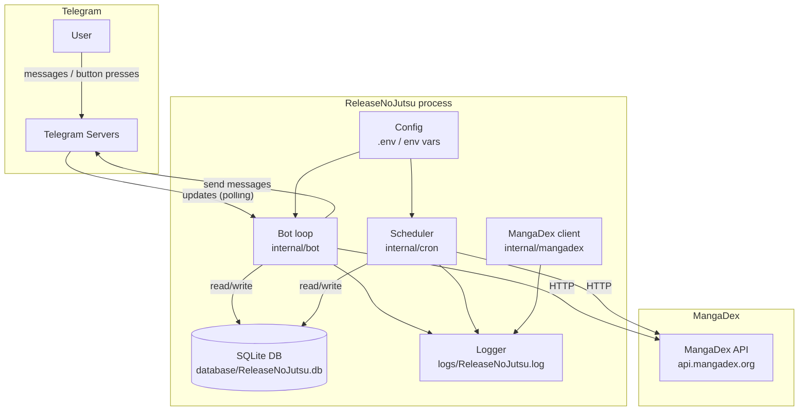
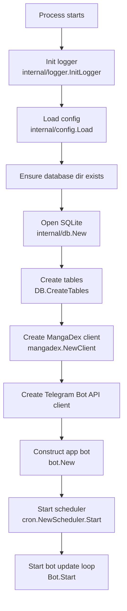
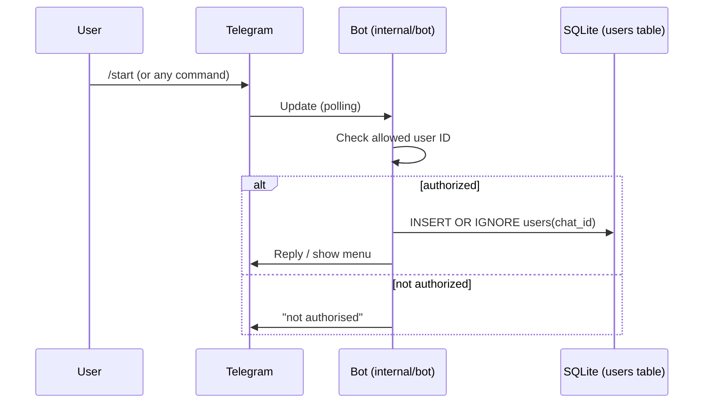
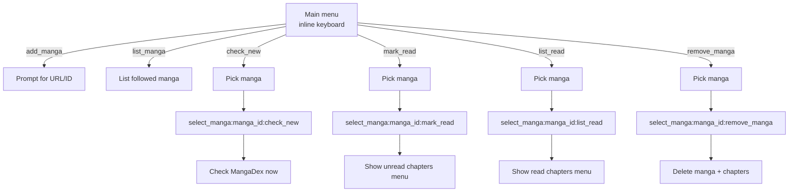
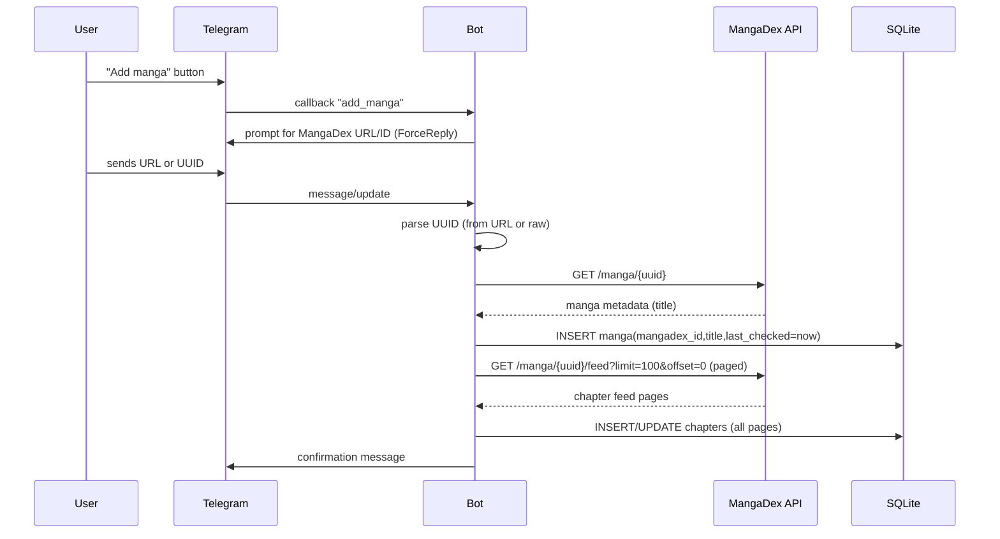
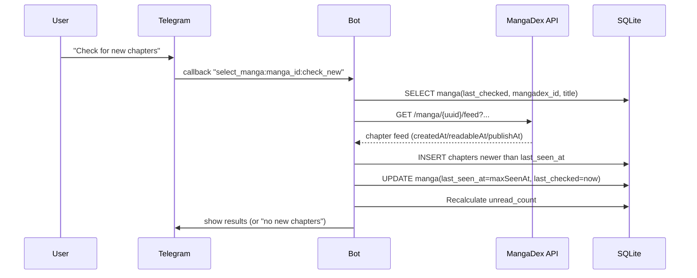
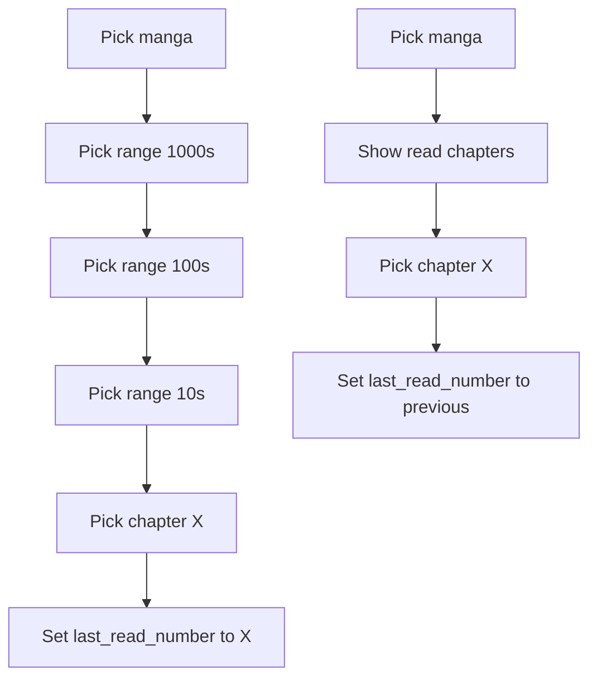
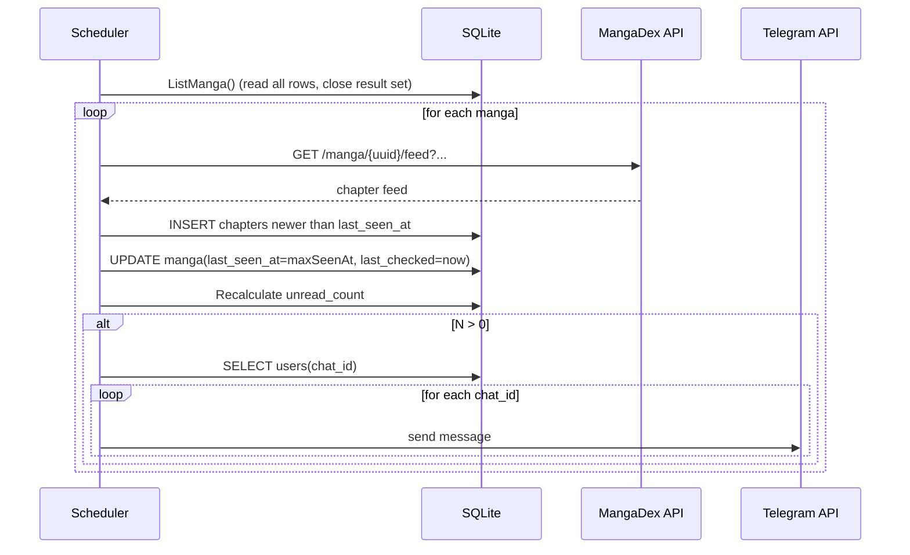
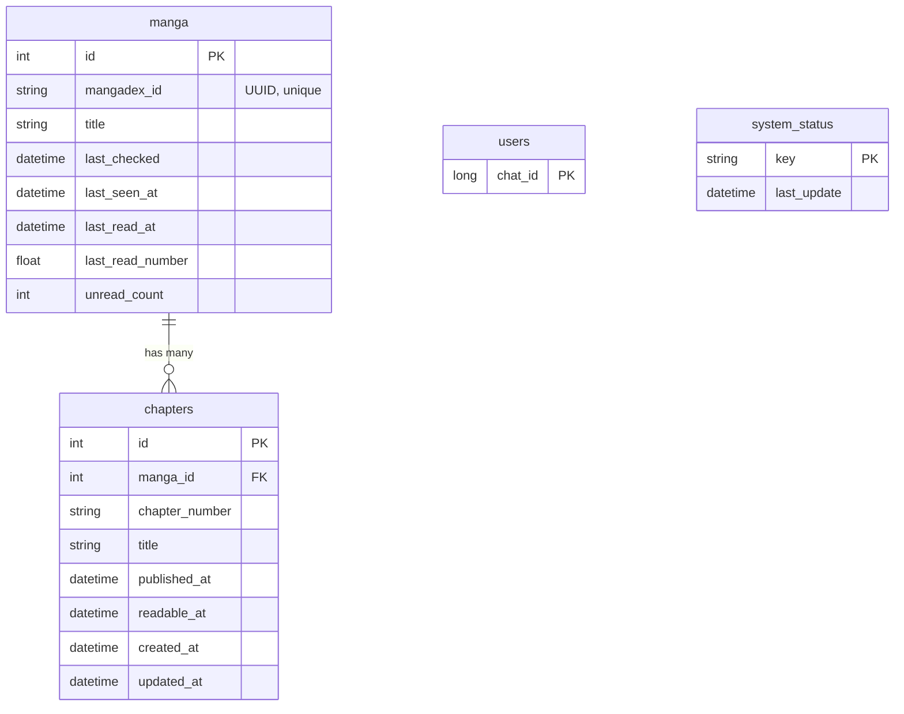

# ReleaseNoJutsu Workflow

This document explains how ReleaseNoJutsu works end-to-end (startup, Telegram interactions, scheduled updates, and persistence), with diagrams you can keep open while reading the code.

## High-Level Purpose

ReleaseNoJutsu is a Telegram bot that:

- Lets you add MangaDex titles (by URL or UUID)
- Stores tracked manga + chapters in SQLite
- Periodically polls MangaDex for new chapters
- Notifies registered Telegram chats when new chapters appear

## Runtime Topology

## Startup Workflow

Entry point: `cmd/releasenojutsu/main.go`

Notes:

- Scheduler runs once immediately at startup and then every 6 hours.
- The bot update loop is a long-running poll (not a webhook).

## Authorization and “Who Gets Notifications”

There are two related concepts:

1. **Who is allowed to use the bot** (authorization)
2. **Who receives proactive notifications** (users table)

Authorization is controlled by `.env`:

- `TELEGRAM_ALLOWED_USERS`: Telegram user IDs that are allowed to interact

Notification recipients are stored in SQLite:

- Table `users(chat_id)` contains chat IDs to notify

The bot ensures that when an authorized chat interacts, its chat ID is inserted into `users`.

## Core Telegram Workflows

### Main Menu -> Action Routing

Buttons send callback data (strings like `add_manga`, `select_manga:<id>:mark_read`, etc.), and the bot dispatches based on those values.

### Add Manga (URL or UUID)

When you add a manga, the bot fetches metadata from MangaDex to resolve a human title and stores it in SQLite. It also fetches the latest few chapters to seed your chapter list.

### Manual “Check New”

The “Check New” menu option does a one-off poll for that manga and stores any new chapters it finds (same logic as the scheduler).

### Mark Read / Unread (Progress Tracking)

Progress is stored per manga as a numeric watermark: `manga.last_read_number` (the highest chapter number you consider read).

Unread chapters are derived by comparing numeric chapter numbers (`CAST(chapters.chapter_number AS REAL)`) against `manga.last_read_number`. The per-manga `unread_count` is maintained as a cached summary of that query.

## Scheduled Update + Notifications

The scheduler periodically scans all tracked manga and compares each chapter’s `seenAt` timestamp against `manga.last_seen_at`.

### Why We Read All Manga First (SQLite Constraint)

SQLite connections are limited to 1 (`SetMaxOpenConns(1)`). Holding a `Rows` iterator open while also trying to write in the same loop can deadlock. The scheduler avoids this by reading all manga into memory first (`ListManga`) and closing the iterator before doing any writes.

## Persistence Model (SQLite)

## Operational Notes

- Environment:
  - `TELEGRAM_BOT_TOKEN` must be set or the bot won’t start.
  - `TELEGRAM_ALLOWED_USERS` must include your Telegram **user ID** (not chat ID) or you’ll be rejected.
- Files:
  - Logs: `logs/ReleaseNoJutsu.log`
  - DB: `database/ReleaseNoJutsu.db`
- Network:
  - MangaDex calls use a 10s timeout with retries/backoff; slow networking can make updates take longer.

## Known Limitations / Implementation Details

- `unread_count` increments when new chapters are found; it is not decremented when you mark chapters read (so it can drift from “actual unread chapters”).
- Chapter insertion uses `INSERT OR REPLACE` without a unique constraint on `(manga_id, chapter_number)`, so “replace” behavior depends on SQLite row identity rather than a logical unique key.

## Tests Map

These tests provide coverage for core behavior:

- MangaDex client parsing and URL extraction: `internal/mangadex/client_test.go`
- SQLite invariants (including “no deadlock after listing manga”): `internal/db/database_test.go`
- Scheduler update behavior and deadlock regression: `internal/cron/cron_test.go`
